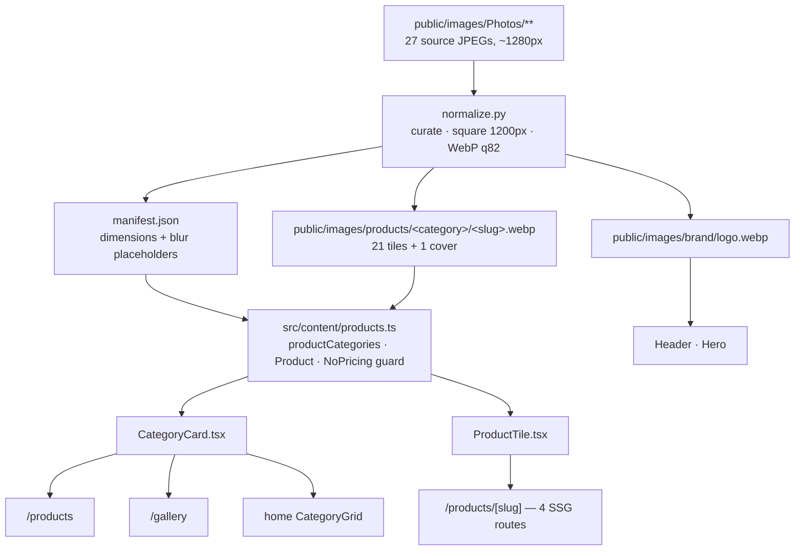

# Phase 3 — Product Imagery: Pipeline, Curation & Reshoot Brief

**Date:** 21 July 2026

## 1. Where the imagery came from

The two catalogue PDFs were **not** used as the image source. Their embedded
photos are 274×252–796×329px — too low-resolution to publish on a site that
sells on the strength of its crockery. They also carry internal wholesale rates
("Matt Melamine = 12/-"), which PRD FR3 forbids from reaching the public site.

The published imagery comes from the 27 photographs in
`public/images/Photos/**` (~1280px), of which **21 were kept and 5 cut**.
One duplicate became a category cover.

## 2. Pipeline



`src/content/products.ts` is the single source of truth. The homepage grid,
`/products`, `/gallery` and the four category routes all read from it, so they
cannot drift apart.

## 3. Normalization decisions

- **Square 1200×1200 WebP.** A consistent tile shape reads as a catalogue
  rather than a camera roll, and on the tall chafing-dish shots the square crop
  also removes most of the floor and ceiling clutter.
- **Blurred-fill instead of crop for five tall shots.** A centre crop cut the
  rim and base off the glassware (the highball became an unreadable slab of
  glass) and cropped the legs off two chafers. Those five are letterboxed onto
  a blurred, slightly darkened copy of their own backdrop, which blends into
  the burlap and dark studio backgrounds they were shot on.
  Affected: `glassware/highball`, `glassware/wine-glass`,
  `glassware/water-tumbler`, `chafing-dishes/brass-round`,
  `chafing-dishes/gold-hammered-square`.
- **Inline 16px blur placeholders** so tiles resolve from the artwork rather
  than flashing grey.

## 4. Photos cut, and why

| Source file | Reason |
|---|---|
| `Malemine/…00.10.37.jpeg` | Wooden platters and bowls — not melamine. Miscategorised; there is no wooden-serveware category yet. |
| `Chrafering-dish/…00.09.55 (1).jpeg` | A domestic wall and electrical switchboard dominate the frame. |
| `Chrafering-dish/…00.09.56 (2).jpeg` | A hand and open street are visible in frame. |
| `Chrafering-dish/…00.09.56.jpeg` | 398×445 source — too low resolution to publish. |
| `Chrafering-dish/…00.09.57.jpeg` | Product is sitting on a cardboard shipping box. |

Nothing was deleted — every original is still in `public/images/Photos/`.

## 5. Reshoot brief (priority order)

1. **Vintage Collection — silver-plated plates. Highest priority.** This is the
   range the business is actively pushing and there is not a single photograph
   of it. The category is live at `/products/vintage` as a named collection
   with an enquiry route, but it cannot sell without images. Shoot the plates
   and service pieces against the same dark backdrop as the bone china, and
   include at least one shot of a full laid cover.
2. **Chafing dishes.** The weakest set by a distance: shot in the warehouse and
   on the street, against pink cloth, curtains, plastic sheeting and cardboard.
   Only 5 of 9 were usable. Reshoot all of them against the same dark backdrop
   the bone china was shot on — that set is the quality bar.
3. **Event photography for `/gallery`.** Every existing photo is a product
   shot, so PRD FR4 ("real event setups") currently has nothing behind it. The
   page is live but `noindex` and excluded from the sitemap until this exists.
   Buffet lines, laid banquet tables, chafers in service.
4. **One isolated plate, shot top-down.** A single charger or dinner plate,
   centred, on a seamless backdrop, with nothing else in frame — no side plate,
   no bowls, no cutlery. Every current photo is a full place setting where the
   plate fills the frame, so no single plate can be cropped out of them. Bone
   china with a gold rim would read best. Lower priority than it was — the
   homepage hero no longer needs one, but a clean single-plate shot is the most
   reusable asset the catalogue could have.
5. **Wooden serveware.** One good photo exists but a category needs ~4.
6. **Melamine consistency.** Two shots are top-down flat-lays on white while
   the rest are elevation shots on dark. Usable, but a uniform set would look
   considerably better.

## 6. Adding a product later

1. Drop the photo in `public/images/Photos/<Category>/`.
2. Add a row to the `KEEP` table in `scripts/normalize-images.py` — source
   filename, slug, display name, and alt text.
3. Run both scripts from `indian-hires-website/`:

```bash
python3 scripts/normalize-images.py          # rewrites public/images/products/**
python3 scripts/generate-products-content.py # rewrites src/content/products.ts
```

Both are deterministic — re-running them on an unchanged `KEEP` table
reproduces byte-identical output. `src/content/products.ts` is generated; edit
the script's tables rather than the `.ts` file, or the next run will overwrite
your changes. Requires Python 3 with Pillow (`pip install Pillow`).

**Pricing must never be added to `src/content/products.ts`.** The `NoPricing`
type makes `price`, `rate`, `cost`, `mrp`, `amount`, `currency` and `discount`
compile errors rather than a review comment.
