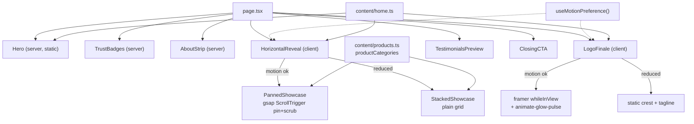

# Homepage Motion Architecture

`src/app/page.tsx`

Two motion beats, each independently gated on the visitor's motion
preference. There is no shared scroll provider — every beat owns its own
lifecycle, so one failing cannot break the others.

## Beat 1 — Hero (static, by design)

`Hero.tsx` is a server component with no motion at all.

It previously carried a scroll-linked plate-recede reveal
(`HeroPlateReveal.tsx`, since removed). In practice the `PlateMotif` rings
rendered as thin gold outlines directly across the headline and CTAs at scroll
position 0 — they read as a watermark someone forgot to delete, not as a
charger receding. The crest reveal already happens properly in Beat 3; doing it
twice, badly, in the hero cheapened the whole page.

What replaced it is composition rather than motion: a wide backdrop
(`scripts/make-hero-backdrop.py`) that places the china whole on the right
against a near-black maroon field, so the left third is genuine negative space
for a left-aligned lockup. Restraint reads more expensive than effects.

## Beat 2 — Horizontal pinned pan

`HorizontalReveal.tsx`. gsap `ScrollTrigger` pins the section and scrubs the
track horizontally by `scrollWidth - innerWidth`.

- **Easing is `none`.** Scrubbed motion must track the scrollbar 1:1; any
  easing makes the panels lead or lag the user's own scroll, which reads as
  broken rather than smooth.
- **Cleanup** is via `gsap.context()` + `ctx.revert()`, which kills every tween
  and ScrollTrigger created inside the scope on unmount. No manual
  `addEventListener`, nothing to leak.
- `invalidateOnRefresh` plus function-form `end` means the pin distance
  recomputes on resize instead of freezing at first-paint width.

## Beat 3 — Logo finale

`LogoFinale.tsx`. The crest scales `0.92 → 1` with opacity `0 → 1` on
`whileInView` (`once: true`), tagline follows at `delay: 0.25`.

- **Never from `scale(0)`** — nothing in the real world appears from nothing.
- Transforms are passed as **full transform strings**, not framer's
  `scale`/`y` shorthands, which are driven on the main thread via rAF and drop
  frames under load.
- The gold glow is a Tailwind keyframe animating **opacity only**, so it
  composites off the main thread. It is disabled under reduced motion.

## Motion gating

`src/lib/useMotionPreference.ts` combines `prefers-reduced-motion` with a
coarse capability check (`saveData`, `hardwareConcurrency ≤ 2`,
`deviceMemory ≤ 2`).

It **returns `true` until the first client effect runs**, so SSR and first
paint render the static path. Motion is opt-in — a visitor never sees a flash
of animation before the preference is known.

Each gated component branches to a *separate component* rather than an internal
flag, so under reduced motion the animation hooks are never mounted at all: no
`useScroll`, no `ScrollTrigger`, no listeners.

## Dependencies

| Package | Why |
|---|---|
| `framer-motion` | finale entrance only. Loaded via `LazyMotion`/`domAnimation` to trim the feature bundle. |
| `gsap` + `ScrollTrigger` | pin + scrub. Framer has no pinning primitive. |

**Not installed:** `three` / `@react-three/fiber` / `@react-three/drei` and
`@studio-freight/lenis`.

The 3D stack would have cost roughly 300 kB gzipped against a TRD target of
Lighthouse ≥95 / TTI < 2.5s / FCP < 1.5s. The homepage ships 182 kB First Load
JS; the R3F route landed it near 450 kB.

Lenis was skipped deliberately: hijacking native scroll costs scroll anchoring,
keyboard paging behaviour and platform scroll feel, which is a poor trade on a
site whose whole job is to look trustworthy on a mid-range Android phone.
